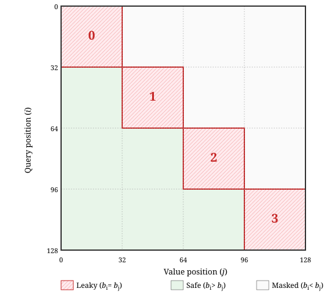
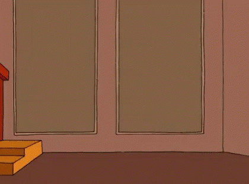

#### Written: September 15, 2026

<iframe class="doc-widget widget-frame" src="./media/kda/kda-future-animation.html" title="Conceptual reference directions from an orange midpoint: green toward earlier positions, red toward later positions." loading="lazy" style="height: 340px;"></iframe>

### Product pitch

TorchTitan has been working on enabling new models. As you most likely know, most new models have moved away from purely global causal attention and now do some combo of GCA (global causal attention) + local attention. We call these hybrid models. They optionally mix in sparse attention for some or all of the layers that used to be GCA. 

It is hard to be nimble in pytorch/pytorch - this is a good and a bad thing. We want to build out useful apis that enable researchers and implementers to get the most out of pytorch. Our Linear Attention apis have been severely lacking here. And our Sparse Apis have been decent through flex-attention but only when sparse granularity is largish (128,128)+. Soooo what are we to do! 

[Attention Gym](https://github.com/meta-pytorch/attention-gym) is changing! 

We are coalescing development of these fun new attention flavors here. We have built a number of primitives for gdn and kda and have been integrating them into torchtitan's training and RL(inference) stack. As well we have been adding more sparse primitives to enable performant DSv4 training in Titan.

"But Driss why would I not just use FLA" That is a great question insightful reader! My honest answer: we pytorch developers are humans. We need a place to explore ideas, find common abstractions, figure out what works and what doesn't. Attention gym is that place for me and others. Long term I would love to develop something as extensible as `Flex Linear Attention` but right now - I don't see it. As well AI has kind of thrown a wrench into this all generalization thing we like doing. If you want to have some influence on where we invest our time; use the repo, open issues and give us feedback. We are dogfooding in torchtitan but would love to hear from other voices.

Another more `polished` answer is that the components we are offering are more specialized to the latest hardware and this allows us to eek <span class="sidenote-pair"><span class="sidenote-ref" tabindex="0" aria-describedby="kda-performance-note">non trivial out performance</span>.<span id="kda-performance-note" class="sidenote" role="note">These performance gains can be very large, but numbers are numbers, and I don't want to include comparisons in this particular blog post.</span></span> We have fully integrated CuDNN's uber mega kernels, a robust CP implementation, paid special attention to making everything cuda-graphable. But if you are using FLA and it works for you and don't want to switch I get it. Its an awesome project and I personally have learned so much from it :)

#### Pitch done - TLDR

 I was working on the intra-chunk kernels for Kimi Delta Attention(KDA) and found that there was a subtle implementation choice that has the potential to break `causality`.  I used [TorchTitan](https://github.com/pytorch/torchtitan) to test whether the model could learn to exploit it.

### What is causality anyways

I think this phrase is is a little to anthropomorphized. A better one is; training inference mismatch. Thats it. We call it causality because this particular form of mismatch is when you let a token at position $N$ receive information from token $M$, for some $M > N$. And in essence $N$ can see the future. This unsurprisingly really helps with the task of next token prediction. What are some ways this might happen;
1. you forget to invoke `F.scaled_dot_product_attention(... causal=True)`. That is an obvious one. There are some other more subtle forms; 
2. Expert choice routing
3. Blockwise scaling of inputs during training

etc etc

This can be subtle, because during training there isnt anything actually `wrong` with this. Either you have a massive information leak and you will see your loss decrease very very rapidly; or it will be a slow trickle. You might even think `damn i really did something with this datamix!`. Dont be fooled, the problems only show up when you try to serve this model using auto-regressive token generation. The model learned that it's only going to see batches of tokens and that this information from token $M$ will always be there to influence what it should predict at token $N$. That's what it learned during training, but at inference, token $M$ doesn't exist yet. We're building up the sequence one token at a time, and the result is you've trained this cracked model, but at inference time, it's going to underperform relative to what you saw during training!

<figure class="kda-figure kda-token-modes" aria-label="Possible prediction mismatch between parallel training and autoregressive inference">
<div class="kda-token-mode">
<div class="kda-label">Training</div>
<svg viewBox="0 0 360 240" role="img" aria-labelledby="kda-training-title kda-training-desc">
<title id="kda-training-title">Next-token distributions computed together</title>
<desc id="kda-training-desc">All three input tokens are available. Solid green arrows show allowed causal inputs: x1 predicts p2; x1 and x2 predict p3; x1 through x3 predict p4. Red dashed arrows show every forbidden future-token connection in this example: x2 into p2, and x3 into p2 and p3. These predictions should not depend on those future tokens. The distributions are computed in parallel. The leak and bars are schematic, not measured KDA results or evidence of learned exploitation.</desc>
<defs>
<marker id="kda-training-arrow" viewBox="0 0 6 6" refX="5" refY="3" markerWidth="5" markerHeight="5" orient="auto"><path d="M0 0L6 3L0 6Z" fill="currentColor" /></marker>
<marker id="kda-leak-arrow" viewBox="0 0 6 6" refX="5" refY="3" markerWidth="5" markerHeight="5" orient="auto"><path class="kda-mode-leak-head" d="M0 0L6 3L0 6Z" /></marker>
<g id="kda-probability-bars"><rect x="0" y="21" width="7" height="11" rx="1" /><rect x="11" y="2" width="7" height="30" rx="1" /><rect x="22" y="13" width="7" height="19" rx="1" /><rect x="33" y="25" width="7" height="7" rx="1" /></g>
<g id="kda-probability-bars-next"><rect x="0" y="15" width="7" height="17" rx="1" /><rect x="11" y="25" width="7" height="7" rx="1" /><rect x="22" y="3" width="7" height="29" rx="1" /><rect x="33" y="18" width="7" height="14" rx="1" /></g>
<g id="kda-probability-bars-last"><rect x="0" y="24" width="7" height="8" rx="1" /><rect x="11" y="17" width="7" height="15" rx="1" /><rect x="22" y="22" width="7" height="10" rx="1" /><rect x="33" y="1" width="7" height="31" rx="1" /></g>
</defs>
<g class="kda-mode-token"><rect x="46" y="48" width="36" height="30" rx="3" /><text x="64" y="68">x₁</text><rect x="159" y="48" width="36" height="30" rx="3" /><text x="177" y="68">x₂</text><rect x="272" y="48" width="36" height="30" rx="3" /><text x="290" y="68">x₃</text></g>
<g class="kda-mode-arrows" marker-end="url(#kda-training-arrow)"><path d="M64 80V135" /><path d="M64 80C64 108 177 105 177 135" /><path d="M64 80C64 117 290 110 290 135" /><path d="M177 80V135" /><path d="M177 80C177 119 290 118 290 135" /><path d="M290 80V135" /></g>
<rect class="kda-mode-batch" x="29" y="139" width="298" height="69" rx="3" />
<g class="kda-mode-leak-arrows" marker-end="url(#kda-leak-arrow)"><path d="M177 80C177 106 82 114 76 143" /><path d="M290 80C290 128 123 165 87 165" /><path d="M290 80C290 104 192 112 188 143" /></g>
<g class="kda-mode-probs"><use href="#kda-probability-bars" x="44" y="147" /><use href="#kda-probability-bars-next" x="157" y="147" /><use href="#kda-probability-bars-last" x="270" y="147" /></g>
<g class="kda-mode-prob-label"><text x="64" y="198">p₂</text><text x="177" y="198">p₃</text><text x="290" y="198">p₄</text></g>
</svg>
</div>
<div class="kda-token-mode kda-token-mode--inference">
<div class="kda-label">Inference</div>
<svg viewBox="0 0 360 240" role="img" aria-labelledby="kda-inference-title kda-inference-desc">
<title id="kda-inference-title">Next-token distributions computed one at a time</title>
<desc id="kda-inference-desc">Start with x1 and compute p2. Sample x2, append it to the prefix, and compute p3. Sample x3, append it, and compute p4. Dashed empty boxes are tokens that do not exist yet; curved arrows feed a sampled token into the next step. Different bar shapes illustrate a possible prediction mismatch if training relied on future information that is unavailable at inference. These are illustrative distributions, not measured KDA results or evidence of learned exploitation.</desc>
<defs>
<marker id="kda-inference-arrow" viewBox="0 0 6 6" refX="5" refY="3" markerWidth="5" markerHeight="5" orient="auto"><path d="M0 0L6 3L0 6Z" fill="currentColor" /></marker>
<g id="kda-inference-bars"><rect x="0" y="8" width="7" height="24" rx="1" /><rect x="11" y="20" width="7" height="12" rx="1" /><rect x="22" y="23" width="7" height="9" rx="1" /><rect x="33" y="10" width="7" height="22" rx="1" /></g>
<g id="kda-inference-bars-next"><rect x="0" y="17" width="7" height="15" rx="1" /><rect x="11" y="7" width="7" height="25" rx="1" /><rect x="22" y="14" width="7" height="18" rx="1" /><rect x="33" y="23" width="7" height="9" rx="1" /></g>
<g id="kda-inference-bars-last"><rect x="0" y="6" width="7" height="26" rx="1" /><rect x="11" y="20" width="7" height="12" rx="1" /><rect x="22" y="14" width="7" height="18" rx="1" /><rect x="33" y="24" width="7" height="8" rx="1" /></g>
</defs>
<g class="kda-mode-token"><rect x="34" y="26" width="36" height="30" rx="3" /><text x="52" y="46">x₁</text><rect x="34" y="104" width="36" height="30" rx="3" /><text x="52" y="124">x₁</text><rect x="34" y="182" width="36" height="30" rx="3" /><text x="52" y="202">x₁</text><rect x="80" y="182" width="36" height="30" rx="3" /><text x="98" y="202">x₂</text></g>
<g class="kda-mode-token kda-mode-token--new"><rect x="80" y="104" width="36" height="30" rx="3" /><text x="98" y="124">x₂</text><rect x="126" y="182" width="36" height="30" rx="3" /><text x="144" y="202">x₃</text></g>
<g class="kda-mode-missing"><rect x="80" y="26" width="36" height="30" rx="3" /><rect x="126" y="26" width="36" height="30" rx="3" /><rect x="126" y="104" width="36" height="30" rx="3" /></g>
<g class="kda-mode-arrows" marker-end="url(#kda-inference-arrow)"><path d="M181 42H232" /><path d="M181 120H232" /><path d="M181 198H232" /><path class="kda-mode-feedback" d="M262 64C262 91 98 79 98 98" /><path class="kda-mode-feedback" d="M262 142C262 169 144 157 144 176" /></g>
<g class="kda-mode-probs"><use href="#kda-inference-bars" x="242" y="26" /><use href="#kda-inference-bars-next" x="242" y="104" /><use href="#kda-inference-bars-last" x="242" y="182" /></g>
<g class="kda-mode-prob-label"><text x="310" y="46">p₂</text><text x="310" y="124">p₃</text><text x="310" y="202">p₄</text></g>
</svg>
</div>
</figure>

### Don't just take my word for it

MatX's [“Future leakage in block-quantized attention”](https://matx.com/research/leaky_quantization) is a really really nice blog. The causal break it found has to do with low precision attention. When values share a quantization scale across token positions, a future outlier can increase that scale and make an earlier value underflow. Seems harmless but models are sneaky, trixy little hobbits and they use signals in remarkable ways! 

<figure class="kda-source-figure" aria-labelledby="matx-leaky-region-caption">

<figcaption id="matx-leaky-region-caption">Figure from MatX, <a href="https://matx.com/research/leaky_quantization">Future leakage in block-quantized attention</a> </figcaption>
</figure>

MX quantization shares one scale across 32 elements along the reduction dimension. In attention's second GEMM, $PV$, we multiply $(N_q \times N_{kv})$ by $(N_{kv} \times D_v)$. So the reduction runs across **token positions**.

In the picture, rows are queries and columns are values. Green blocks are entirely in the past -> all query indices > all  kv indices; gray blocks are fully masked. The **red diagonal blocks** have mixed sign. If we naively quantized there would be a path for info to flow form kv_index > q_index.

We shall see this future leakage ends up looking very similar to our KDA example but not through low precision quantization but a rescale factor.

MatX describes a really nice experimental process for finding this leak: train a small model and measure its performance on a held-out set, evaluating in two modes: parallel and autoregressive. If autoregressive performance is worse, that's a good sign your model's training setup isn't mirroring its inference setup. Their fix is also quite nice—>I encourage you to read the blog! We'll use this technique to see if our causal break is measurable.

## Chunkwise KDA in Broad Strokes

KDA is a delta-rule linear attention variant. Like many other linear attention variants it stores info in a recurrent state that is calculated earlier tokens:

<div id="kda-base-recurrence">

$$
\begin{alignedat}{3}
\text{Definition:}\\
\text{(0)}&\quad D_i
&&=\operatorname{diag}(2^{g_i})
&\qquad&\text{form the per-channel decay operator},\\
\text{(1)}&\quad\widetilde S_i
&&=D_iS_{i-1}
&\qquad&\text{decay the previous state},\\
\text{(2)}&\quad\widehat v_i
&&=k_i^\top\widetilde S_i
&\qquad&\text{read the existing value associated with the current key},\\
\text{(3)}&\quad z_i
&&=\beta_i\left(v_i-\widehat v_i\right)
&\qquad&\text{given the current value, compute the scaled prediction error},\\
\text{(4)}&\quad S_i
&&=\widetilde S_i+k_iz_i^\top
&\qquad&\text{write that correction at the current key},\\
\text{(5)}&\quad o_i
&&=s q_i^\top S_i
&\qquad&\text{read the updated state with the current query}.
\end{alignedat}
$$

</div>

This recurrent form is great when we are decoding 1 token at a time but for training it is not efficient. If only there was some way to turn this memory bound problem into one that can use our tensorcores.. <span class="sidenote-hover"><button type="button" class="sidenote-trigger" aria-describedby="kda-chunking-reaction">CHUNKING!</button><span id="kda-chunking-reaction" class="sidenote sidenote--hover-media" role="note"></span></span>

The chunked implementation reorganizes that recurrence into local matrix operations plus a state update across chunks, this shortens our sequential depth at the cost of explicitly computing pairwise terms within each chunk. 

The math is really fun but im hesitant to dive super deep here cause it can be distracting. SO stick with me and let's follow one of those pairwise terms: how query $i$ reads the correction written at token $j$; which comes from `step 5` in this recurrence.

## Chunkwise Aqk

We will store these scalar weights in a matrix $A_{qk}[i,j].$ How do we calculate this? Well that depends on how the query and key line up (dot prod), and how much each channel has decayed between the two tokens.

From here on, $G_{i,d}=\sum_{t=0}^{i}\delta_{t,d}$ is the <span class="sidenote-pair"><span class="sidenote-ref" tabindex="0" aria-describedby="kda-gate-units-note">cumulative log-base-2 gate</span> at token $i$, <span class="sidenote-ref" tabindex="0" aria-describedby="kda-channel-gate-note">channel $d$</span>, measured within the chunk.<span class="sidenote" role="note"><span id="kda-gate-units-note">Attention Gym's KDA API uses natural-log gates. The lower bound is currently capped at $-5,$ that means means the strongest decay =  $e^{-5}\approx0.006738$: or in other words only about 0.67% of the previous state is retained before the other update terms.</span><br><br><span id="kda-channel-gate-note">Notice that extra $d$ index. GDN uses one decay per token per head; KDA gives every key channel its own. Seems like a small change, but as we'll see it makes a big difference to how we implement the chunkwise kernel.</span></span></span> The increments $\delta_{t,d}$ are the per-token log2 gates called $g$ in the recurrence above.

Suppose $j<i$. Token $j$ writes a correction into the state. By the time query $i$ reads it, that correction has been decayed at every step from $j+1$ through $i$. We start at $j+1$ because each token decays the existing state *before* adding its own correction.

With $D$ channels, and leaving out the usual query scale $s$, the weight on that correction is:

<div id="kda-aqk-definition">

$$
A_{qk}[i,j] = \sum_{d=1}^{D} q_{i,d} k_{j,d} 2^{G_{i,d}-G_{j,d}}, \qquad j \leq i.
$$

</div>

We can see a few things; entries with $j>i$ are masked to zero if not the decay would flip signs and suddenly we would have a Kimi Explosive attention! $G_{i,d}$ is nonincreasing with increasing $i$ starting from $0$ so the decay is at most $1$ or (kimi never forget attention)!

<details>
<summary>Trace Aqk back to the base recurrence</summary>

Call the incoming state $H_c$, with chunk-local boundaries $S_{-1}=H_c$ and $G_{-1}=0$. After token $i-1$, the state is:

<div id="kda-previous-state">

$$
\begin{aligned}
S_{i-1}
&=\operatorname{diag}(2^{G_{i-1}})H_c\\
&\quad+\sum_{0\le j<i}
\operatorname{diag}(2^{G_{i-1}-G_j})k_jz_j^\top.
\end{aligned}
$$

</div>

Apply token $i$'s decay and write to that previous state, using <span class="sidenote-hover"><button type="button" class="sidenote-ref sidenote-trigger" aria-describedby="kda-decay-write-preview">steps (1) and (4)</button><span id="kda-decay-write-preview" class="sidenote sidenote--hover-media" role="note">$\widetilde S_i=D_iS_{i-1}$<br>$S_i=\widetilde S_i+k_iz_i^\top$</span></span>. Since $G_i=G_{i-1}+\delta_i$:

<div id="kda-postwrite-state">

$$
\begin{aligned}
S_i
&=D_iS_{i-1}+k_iz_i^\top\\
&=\operatorname{diag}(2^{G_i})H_c\\
&\quad+\sum_{0\le j\le i}\operatorname{diag}(2^{G_i-G_j})k_jz_j^\top.
\end{aligned}
$$

</div>

<span class="sidenote-hover"><button type="button" class="sidenote-ref sidenote-trigger" aria-describedby="kda-write-fold-preview">The new write is the $j=i$ term</button><span id="kda-write-fold-preview" class="sidenote sidenote--hover-media" role="note">The old sum stops at $j<i$. Extending it to $j\le i$ adds exactly:<br>$\begin{aligned}&\operatorname{diag}(2^{G_i-G_i})k_i z_i^\top\\&\quad=k_i z_i^\top.\end{aligned}$<br>This absorbs the separate $+k_i z_i^\top$ from the first line.</span></span>, with no relative decay yet: $2^{G_i-G_i}=1$.

Substitute this updated state into <span class="sidenote-hover"><button type="button" class="sidenote-ref sidenote-trigger" aria-describedby="kda-read-preview">step (5):</button><span id="kda-read-preview" class="sidenote sidenote--hover-media" role="note">$o_i=s q_i^\top S_i$</span></span>

$$
\begin{aligned}
o_i
&=s q_i^\top S_i\\
&=s(q_i\odot2^{G_i})^\top H_c\\
&\quad+s\sum_{j\le i}
\underbrace{\left(\sum_d q_{i,d}k_{j,d}2^{G_{i,d}-G_{j,d}}\right)}_{A_{qk}[i,j]}
 z_j^\top.
\end{aligned}
$$

Et voilà, we have our $A_{qk}[i,j]$ weight: **how much query $i$ reads from completed write $z_j$.** The first term reads incoming history; the sum reads this chunk's writes. We keep $s$ outside the weight, as before.

Attention Gym's [composed forward path](https://github.com/meta-pytorch/attention-gym/blob/52c9eaa31e87a28dc0d3d9464af2088e6384a483/attn_gym/linear/kda/fwd/cute/chunk_kda_fwd.py) puts these pieces together.

</details>

## The rebasing trick

Now how do we feed this to tensorcores? A GEMM computes $\sum_d L_{i,d}R_{j,d}$: the left operand depends on $(i,d)$, and the right on $(j,d)$. But our decay $2^{G_{i,d}-G_{j,d}}$ mixes all three indices **inside** the sum. We cannot just compute $QK^T$ and scale each output, because the decay changes with $d$.

The simple trick is that this mixed term can separate into the two operands we need:

$$
2^{G_{i,d}-G_{j,d}}
=\underbrace{2^{G_{i,d}}}_{(i,d)}\,
\underbrace{2^{-G_{j,d}}}_{(j,d)}.
$$

We then re-associate these terms -> the first factor on the query and the second on the key, and we have a GEMM!


The catch is that the split factors can be <span class="sidenote-pair"><span class="sidenote-ref" tabindex="0" aria-describedby="kda-decay-range-note">tiny and huge even although their product is well behaved</span><span id="kda-decay-range-note" class="sidenote" role="note">Unsplit, $2^{G_{i,d}-G_{j,d}}$ measures decay only from $j+1$ to $i$. Split, $2^{G_{i,d}}\cdot2^{-G_{j,d}}$ uses two cumulative gates measured from the start of this chunk.</span></span>.

After splitting, we choose a reference gate $r_d$, shared across the block for each channel, to tame those extremes without changing the product:

$$
2^{G_{i,d}-G_{j,d}} = 2^{G_{i,d}-r_d}\,2^{r_d-G_{j,d}}.
$$

Now define rescaled operands:

$$
\widetilde Q_{i,d}=q_{i,d}2^{G_{i,d}-r_d},
\qquad
\widetilde K_{j,d}=k_{j,d}2^{r_d-G_{j,d}}.
$$

With that reference fixed, the left operand uses only $(i,d)$ and the right only $(j,d)$. Multiply $\widetilde Q\widetilde K^T$, then mask future entries. And like magic we can finally use these tensorcores!

## Whats the catch?

While we tend to use a chunk size of 64 for the state updates, splitting the decay this way has broader ramifications. **How far can we get from our reference before the growing factor overflows?**

The [lowest decay we accept is $-5$](https://github.com/meta-pytorch/attention-gym/blob/52c9eaa31e87a28dc0d3d9464af2088e6384a483/attn_gym/linear/kda/gate.py#L22), the same as K3. Suppose every gate were at that bound, then what? How big, and how small, could our separated factors get?

Each step adds another $-5$ to the cumulative natural-log gate. At distance $k$ from the first-row reference, the factors become:

$$
e^{-5k}=2^{-5k\log_2 e},\qquad e^{5k}=2^{5k\log_2 e}.
$$

```chart
{"src":"media/kda/rebase-range.json","title":"What if every gate is at −5","height":280}
```

An $N$-token window spans $N-1$ steps. After just **18 steps**, the growing factor reaches about $2^{129.8}$, beyond the largest finite FP32 or BF16 value! Quite the pickle aint it.

We need to avoid 0(underflow) * `inf`(overflow) = `nan`.  we pick the largest <span class="sidenote-pair"><span class="sidenote-ref" tabindex="0" aria-describedby="kda-multiple-eight-note">multiple of 8</span> that fits: **16 key columns**.<span id="kda-multiple-eight-note" class="sidenote" role="note">Why 8, you ask? As we'll see in the hardware section, we need a width that fits the $N$ dimension of our <code>tcgen05.mma</code> instruction, which requires multiples of 8.</span></span>

## Decisions Decisions

So how do we choose $r_d$ within that window? Reusing a gate that's already available is convenient and fast, so let's pick one from the block. For reasons that may or may not be obvious; two natural choices are the **first row, $G_0$**, or the **midpoint, $G_8$**.

With infinite precision, $r_d$ cancels perfectly, so it wouldn't matter which reference we chose. But these are floats: the operands are rounded separately, beware of ghosts in the machine.

<div class="kda-punchline">

The following graphic is basically the punchline of this whole post. What you should hopefully grok from it is that **any unmasked weight in query 5's row of $A_{qk}$ can change** with midpoint rebasing, purely by changing the gates at tokens 6, 7, and 8!

</div>

<iframe class="doc-widget widget-frame" src="./media/kda/aqk-rescale.html" title="Compare first-row and midpoint references for the same retained Aqk entry, query 5 reading token 2's write, while varying only future decay gates." loading="lazy" style="height: 900px;"></iframe>

With $G_0$, those future gates never influence, with $G_8$, they do, and rounding can keep them from cancelling. <span class="sidenote-hover"><button type="button" class="sidenote-trigger" aria-describedby="kda-mask-reaction">No causal mask fixes this.</button><span id="kda-mask-reaction" class="sidenote sidenote--hover-media" role="note"><span class="sidenote-hover-caption"></span></span></span>
## Can models even utilize this info?

Future gates can change earlier weights. But can a model learn to use that information to `cheat`? Let's train some models and find out!

Another small plug for [TorchTitan](https://github.com/pytorch/torchtitan): [Attention Gym's](https://github.com/meta-pytorch/attention-gym) KDA(and GDN) kernels are fully integrated into its training stack. Which made this a very straightforward experiment to run!

### Training setup

I trained two smallish KDA model sizes on **GB300s**, using C4. For each size, I paired first-row (causal) and midpoint forward rebasing, holding the initialization seed, data order, and other training settings fixed.

| Model | Total params | C4 tokens per model | Tokens / param |
| --- | --- | --- | --- |
| Pilot | 520M | About 1.05B | ≈2.0 |
| Scaled | 1.45B | About 4.0B | ≈2.8 |

### What we measure

Once the models are trained we measure our cross-entropy on a held out set and see how much does it increase when we switch from parallel to autoregressive evaluation. Losses use natural logs and are averaged over valid tokens.

$$
\begin{aligned}
G &= \mathrm{CE}_{\mathrm{autoregressive}} - \mathrm{CE}_{\mathrm{parallel}}, \\
\Delta G &= G_{\mathrm{midpoint}} - G_{\mathrm{causal}}.
\end{aligned}
$$

If the midpoint model learned to exploit the future, autoregressive evaluation should hurt it more: positive $\Delta G$. We can also use the first-row model to gives us a baseline for numerical differences between evaluation modes without future leakage (hopefully there is ~0).

```chart
{"src":"media/kda/training-loss.json","title":"Training loss","height":300}
```

```chart
{"src":"media/kda/scaled-loss.json","title":"Held-out loss","height":300}
```

*1.45B models, 64 held-out sequences.*

```chart
{"src":"media/kda/scaled-gap.json","title":"Autoregressive gap","height":300}
```

*1.45B models, 64 held-out sequences. Positive means higher autoregressive loss.*

<div class="kda-paired-charts">

```chart
{"src":"media/kda/paired-checkpoints.json","title":"Excess autoregressive gap","height":300}
```

I also reran the smaller variants with seeds 11 and 23, alongside seed 42. This plot shows each pair's extra autoregressive penalty. Error bars show one standard error, estimated from different held-out documents.

```chart
{"src":"media/kda/paired-seeds.json","title":"Final checkpoints","height":300}
```

*Final checkpoints, 1,024 matched sequences per pair.*

</div>

### What this all mean?

At first, midpoint even looked slightly better?! But after rerunning across the different seeds we can see that the delta G flips across different runs and the standard error tends to cover a delta g == 0. 

The larger model's final $\Delta G$ was **+0.0000088 nats/token**, with a paired standard error of **0.0000512 nats/token** -> essentially 0.

<div class="kda-punchline">

**We found no detectable autoregressive penalty, and no consistent midpoint advantage across seeds and metrics.**

</div>

## Why is it hard to extract the future signal?

Lets take a step back; we have empirically data to show that using the midpoint base doesn't seem to brick the model.. but could it in theory? Do we have any bounds on the strength of this signal?

Define channel $d$’s exact contribution to one retained matrix entry:

$$
c_d = q_{i,d}k_{j,d}2^{G_{i,d}-G_{j,d}}.
$$

Away from overflow and underflow, write the computed rescaled operands as their exact values times $(1+\epsilon^Q_d(r))$ and $(1+\epsilon^K_d(r))$. These errors include operand preparation and depend on the reference and inputs. To first order:

$$
\widehat A_{qk}(r)-A_{qk}
\approx
\sum_d c_d\bigl(\epsilon^Q_d(r)+\epsilon^K_d(r)\bigr)
+\epsilon_{\mathrm{dot}}(r),
$$

Here, $\epsilon_{\mathrm{dot}}$ is the additive dot-product and output-rounding error. The future reference cancels out of each exact $c_d$; it affects only the errors.

That is very different from handing the model a future value vector:

- **The reference is not the next token.** It is a per-channel cumulative gate that may combine several future increments. The model would still have to recover a useful next-token feature from it.
- **A changed output is not necessarily a predictive change.** Rounding also depends on the queries, keys, decay regime, and proximity to representable numbers. Counting changed elements does not measure future information.
- **Channel contributions are mixed.** Signed contributions can cancel, reinforce, or be attenuated by later computation. I did not establish that the rounding errors are independent or zero-mean.
- **The backward pass is not an exact derivative of the rounding channel.** The ideal expression has zero derivative with respect to the cancelling reference. Ordinary kernel gradients do not model every rounding boundary, though training might still exploit or amplify the signal indirectly.

### Probe the residual, not just the loss

I captured exact KDA inputs from layers 0 and 1 of the trained causal 1.45B model on 1024 held-out sequences, ran those same inputs through both reference variants, and formed:

$$
R = O_{\mathrm{midpoint}} - O_{\mathrm{causal}}.
$$

This residual is a **reference-choice difference**, not a pure measurement of future information. Changing references can change rounding even where both references are already available, and the state can carry those differences into later strips.

About **45–49% of output elements** differed in this capture, and about **60% of those differences were exactly one BF16 ULP**.

| Probe | Recorded result | What it checks |
| --- | --- | --- |
| Ridge regression for the future gate | $R^2$ approximately zero | No useful linear readout in this probe |
| MLP regression for the future gate | $R^2$ about 0.001, comparable to the current-gate control | A weak decay-regime signal is not necessarily future-specific |
| Next-token prediction with real versus shuffled residuals | Paired cross-entropy difference about zero | No detected incremental predictive benefit from the residual |

The next-token probe used the top-1024-token task and sequence-separated splits. Its recorded paired cross-entropy difference was **0.000 ± 0.005 nats**; the uncertainty convention still needs checking against the original report before publication. The same probe family extracted **0.4–0.7 nats** of predictive information from ordinary causal features, so it could learn useful signals.

These probes do not prove zero channel capacity. They covered two layers of one trained causal model with particular readouts, not every nonlinear decoder, midpoint-trained representation, or precision and training regime.

> [!todo] Residual figures
> Add the worklog's residual/ULP distribution and the future-gate and next-token probe comparisons, if available. Caption them as reference-choice residuals, not “percent of elements leaking the future.”

## Why would we even want to use midpoint rebasing?

The $16\times16$ diagonal block is only part of the hardware work. The SM100 engine issues a strip of <span class="sidenote-pair"><a class="sidenote-ref" href="https://docs.nvidia.com/cuda/parallel-thread-execution/#tcgen05-matrix-shape" aria-describedby="kda-instruction-shape-note">64 query rows by 16 key columns</a>.<span id="kda-instruction-shape-note" class="sidenote" role="note">The <a href="https://github.com/meta-pytorch/attention-gym/blob/0653a9ba568f980df628652f372e394c233b43d8/attn_gym/linear/kda/fwd/cute/chunk_kda_fwd_intra_engine.py">SM100 engine</a> issues <code>tcgen05.mma</code> with $M=64$, $N=16$, $K=16$: BF16 inputs and FP32 accumulation. Eight instructions cover the 128-channel reduction. The $16\times16$ diagonal block is only part of that rectangle.</span></span>

With first-row rebasing, **each key group gets its own reference, and we rescale the query rows for each group.** Keys 0–15 use $G_0$, keys 16–31 use $G_{16}$, and so on.

Query 63 reading key 15 has 48 steps of real decay, plus 15 extra steps that the key factor cancels. Reading its own write uses $G_{48}$ instead, so again only 15 steps need cancelling. **The 16 limits the extra decay and amplification, not how far back a query can read.**

<iframe class="doc-widget widget-frame" src="./media/kda/mma-strip-map.html" title="A 64 by 16 tcgen05 MMA footprint over a 64-token Aqk matrix: query rows, key columns, and 16 channels per instruction." loading="lazy" style="height: 700px;"></iframe>

Each strip covers the diagonal triangle and the causal squares below it. This bounds the growing gate factor; underflow, Q/K scaling, and later rounding still need accuracy checks.

<details>
<summary>Why not share one base across all 64 keys?</summary>

I tried chunk-wide rebasing earlier. Even with the training module initialized near **−2.5 in natural-log units**, not the −5 bound, it exceeded the exponent range for every measured chunk/head/channel triple. My optimization harness used mild random gates and had missed it.

That is different from 64 query rows reading 16 keys. Extending the key range makes the reciprocal factor grow; adding later queries only adds decay. At that initial per-token decay, a 16-key first-row window spans about 54 base-2 log units, so the bounded 16-token choice did not have the same overflow problem.

</details>


## Could midpoint rounding still be better?

Could changing the reference improve training through better numerics, without using future information?

For one channel, let $G_{\min}$ and $G_{\max}$ be the smallest and largest cumulative gates in the rebasing window. Ignoring Q/K magnitudes, the unrestricted reference that minimizes the worst gate-factor exponent displacement is:

$$
r^* = \frac{G_{\max}+G_{\min}}{2}.
$$

The first-row reference sits at $G_{\max}$ and uses the full gate span on one side; $r^*$ uses half on either side. This buys factor headroom, but is not a causal algorithm: finding the extrema over the whole window reads the future for early queries.

**The midpoint token is not necessarily the midpoint gate value.** With roughly constant per-token gate deltas, row 8 in a 16-token window is close to halfway through the cumulative decay. With bursty deltas, most decay might occur before or after row 8, differently in each channel. Centering the token index need not center the exponents.

The Q/K magnitudes matter too. Ignoring exact zeros, the operand log-magnitudes are:

$$
\log_2|\widetilde Q_{i,d}| = \log_2|q_{i,d}|+G_{i,d}-r_d,
\qquad
\log_2|\widetilde K_{j,d}| = \log_2|k_{j,d}|+r_d-G_{j,d}.
$$

Balancing the gates need not balance the operands. Their joint distribution, proximity to underflow/overflow, and the final sum’s conditioning all affect numerical error.

Inside the normal range, moving a BF16 operand closer to one does not add relative precision: every normal binade has the same significand width. Rescaling changes which values round up or down; it can improve or worsen an answer without giving a systematic gain. Avoiding underflow or overflow is a separate range benefit.

### What we measured for this hypothesis

I compared both references against an FP64 recurrent reference with fixed BF16 inputs: sequence length 1024, four heads, and per-token gates uniform in $[-s,0]$ nats for $s$ in $\{0.5,1,2.5,4,5\}$. The ratio of midpoint to causal **mean error** stayed between **0.99 and 1.02**; below one favors midpoint. This sweep showed no systematic accuracy benefit, but does not cover every distribution of gate deltas.

The trained model’s gate histograms were bimodal, near zero and the $-5$ nats/token bound. In layers 0 and 1, respectively, **9.0% and 17.6%** of captured per-token gates were below $-4.9$ nats. Near-bound values need not be exact point masses; the spread within each mode matters. I would not assume independent, uniformly distributed rounding errors.

In a separate trained-model audit, causal-reference query operands very rarely reached the subnormal range; midpoint operands had no subnormal exposure in that capture. This supports a range advantage on those inputs, not a measured model-quality advantage.

**Midpoint rebasing may help when important operands approach a range boundary, though these runs showed no systematic accuracy or quality benefit.** To test that, vary gate-delta distributions and operand magnitudes separately, compare against the same high-precision reference, and measure boundary exposure alongside error. Do not also change the gate bound or subchunk size.

> [!todo] Precision figures
> Add the worklog's error-versus-gate-range and gate/operand-distribution plots, if available. Distinguish per-token deltas, cumulative gate spans, and actual rescaled operand exponents in the captions.

## What I take away

The midpoint reference creates **numerical future dependence**. These experiments **did not detect learned exploitation**—not the same as showing there is no leak.

A quantity that cancels in algebra can still carry information through finite-precision intermediates. The mask is only part of the causality contract; we also have to check where normalization and scaling values come from.

For this path, I kept the first-row reference as the default, with bounded rebasing windows and a prefix-invariance regression.

**A causality violation, a learnable predictive signal, and a better numerical approximation are three different claims.** A test for one does not settle the other two.

## Still to add before publishing

- A minimal suffix-gate counterfactual and public, commit-pinned links to the tested kernels, including the earlier isolated Aqk probe and initialization gate-range measurements.
- The residual-probe and precision-distribution figures, which were not present in the retrieved W&B evaluation series.
- Exact run manifests and the paired-analysis code. The figure snapshot preserves the logged standard errors; verify their construction against the original per-sequence analysis before publication.

These results concern the implementation and configurations tested here, not every KDA implementation or production Kimi model.
